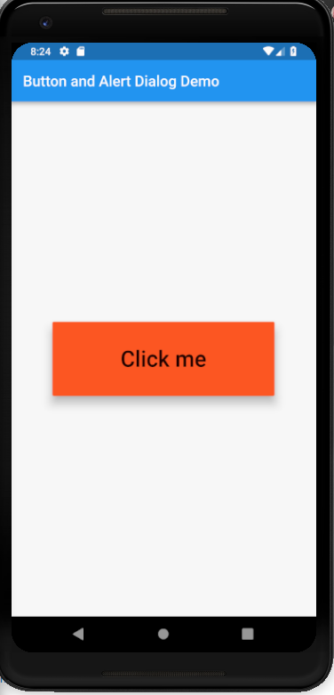

# alert_dialog

A new Flutter project which explains the use of buttons and alert dialogs in flutter.

## Steps to use Buttons and Alert Dialogs

* Define the Button widget using the code:

```
child: RaisedButton(
            child: Text(
              "Click me",
              style: TextStyle(fontSize: 30.0),
            ),
            elevation: 10.0,
            color: Colors.deepOrange,
            onPressed: () =>alertDialog(context)
          )
```

* The method alertDialog() is called when the raised button is called.

* The method consists of code to invoke an alert dialog when the button is clicked:

```
AlertDialog alertD = AlertDialog(
      title: Text("Flight Booked Successfully"),
      content: Text("Have a pleasant flight"),
    );

    showDialog(context: context, builder: (BuildContext context) => alertD);
```

<hr>

 
