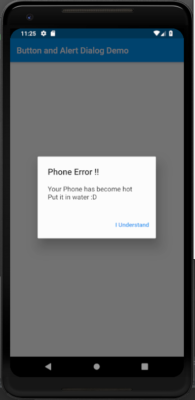

# alert_dialog

A new Flutter project which explains the use of buttons and alert dialogs in flutter.

## Steps to use Alert Dialogs

* The method consists of code to invoke an alert dialog when the IconButton is clicked:

```dart

  void alertDialog(BuildContext context) {

    showDialog(
      context: context,
      barrierDismissible: false,
      builder: (BuildContext context) {
        return AlertDialog(
          title: Text(
            "Phone Error !!"
          ),
          content: SingleChildScrollView(
            child: ListBody(
              children: <Widget>[
                Text(
                  "Your Phone has become hot"
                ),
                Text(
                  "Put it in water :D"
                )
              ],
            ),
          ),
          actions: <Widget>[
            FlatButton(
              child: Text(
                "I Understand"
              ),
              onPressed: () {
                Navigator.pop(context);
              },
            )
          ],
        );
      }
    );

  }

```

<hr>


