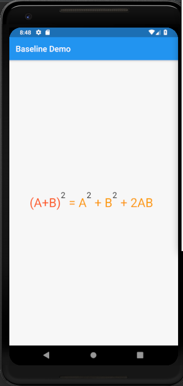

# baseline

A new Flutter application which explains Baseline Widget

## How to use Baseline Widget

 - Use the following code to add the Widget '2' to give the impression of sqaure
 
 ```
 
    Baseline(
            baseline: -12,
            baselineType: TextBaseline.alphabetic,
            child: Text(
               "2",
               style: TextStyle(
                  fontSize: 20.0
                   ),
                ),
            )
 
 ```

### Screenshot


