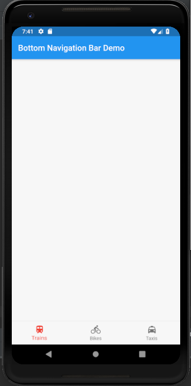
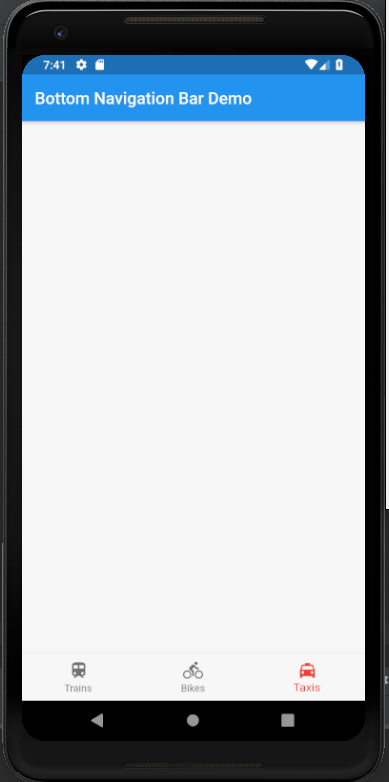

# bottom_navigation_bar

A new Flutter application which explains how to implement Bottom Navigation Bar in Flutter apps

## How to setup a Bottom Navigation Bar

 - Use the following code in Scaffold to setup a Bottom Naavigation Bar with 3 icons
 
 ```dart
 
 bottomNavigationBar: BottomNavigationBar(
           items: <BottomNavigationBarItem>[
             BottomNavigationBarItem(
               icon: Icon(Icons.train),
               title: Text(
                 "Trains"
               )
             ),
             BottomNavigationBarItem(
                 icon: Icon(Icons.directions_bike),
                 title: Text(
                   "Bikes"
                 )
             ),
             BottomNavigationBarItem(
                 icon: Icon(Icons.local_taxi),
                 title: Text(
                     "Taxis"
                 )
             )
           ],
           currentIndex: selectedItem,
           onTap: changeIcon,
           fixedColor: Colors.red,
       )
 
```

 - To add an item we use:
 
 ```
 
    BottomNavigationBarItem(
                   icon: Icon(Icons.train),
                   title: Text(
                     "Trains"
                   )
 
 ```
 
  - We use currentIndex parameter to set the icon which is selected
  
  ```
  
    currentIndex: selectedIcon
  
  ```
  
  
  ### Screenshots
  
   
