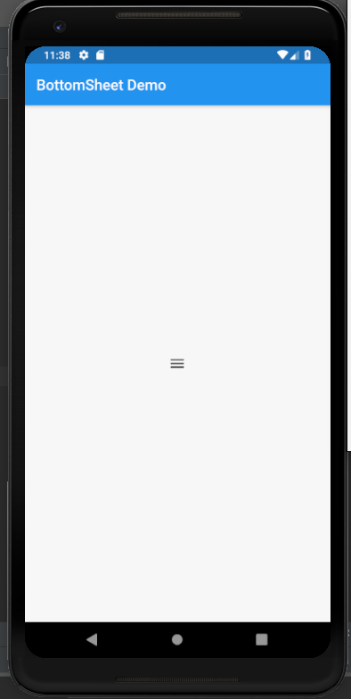
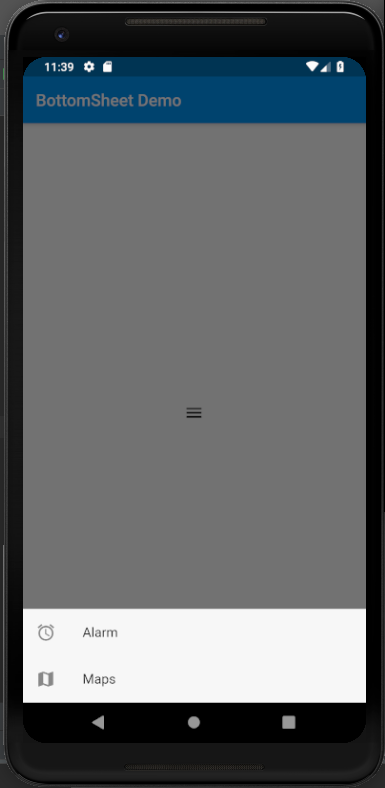

# bottom_sheet

A new Flutter application which implements BottomSheet Widget

## How to implement a BottomSheet

- Use the following method to implement a BottomSheet

```

  void openBottomSheet(context) {
    showModalBottomSheet(
        context: context,
        builder: (BuildContext context) {
          return Container(
            child: Wrap(
              children: <Widget>[
                ListTile(
                  leading: Icon(Icons.alarm),
                  title: Text("Alarm"),
                  onTap: () {
                    Navigator.pop(context);
                  },
                ),

                ListTile(
                  leading: Icon(Icons.map),
                  title: Text("Maps"),
                  onTap: () {
                    Navigator.pop(context);
                  },
                )
              ],
            ),
          );
        }
    );
  }

```

 - Then call this method from the onPressed attribute of any Widget
 
 ```
 
         IconButton(
             icon: Icon(Icons.menu),
             onPressed: () {
               openBottomSheet(context);
             }
         )
 
 ```
 
 
 ### Screenshots
 
  