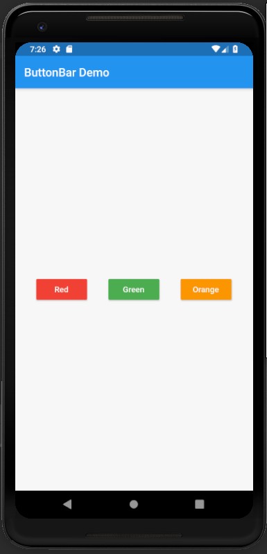

# button_bar

A new Flutter application which explains the use of ButtonBar Widget in Flutter.

## How to implement a ButtonBar in Flutter

- Use the following code to implement ButtonBar

```dart

        ButtonBar(
          children: <Widget>[
            RaisedButton(
              onPressed: () {

              },
              child: Text(
                "Red"
              ),
              color: Colors.red,
              textColor: Colors.white,
            ),

            RaisedButton(
              onPressed: () {

              },
              child: Text(
                  "Green"
              ),
              color: Colors.green,
              textColor: Colors.white,
            ),

            RaisedButton(
              onPressed: () {

              },
              child: Text(
                  "Orange"
              ),
              color: Colors.orange,
              textColor: Colors.white,
            )
          ],
          alignment: MainAxisAlignment.spaceEvenly,
        )

```

- This code is used to arrange 3 RaisedButton in a row

- To evenly space the 3 buttons we use the following attribute of ButtonBar

```dart

    alignment: MainAxisAlignment.spaceEvenly

```


### Screenshot


