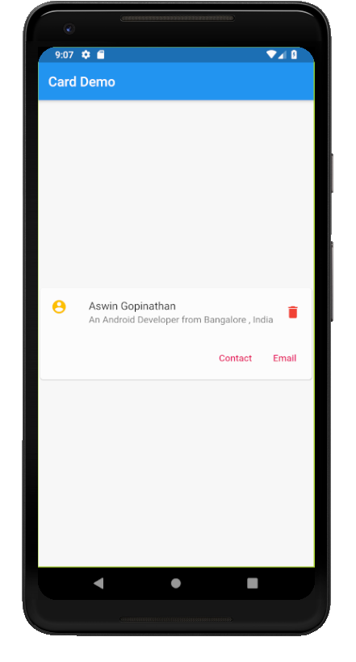

# card

A new Flutter application which implements a Card

## How to implement a Card of the type shown in the Screenshot

- Use the code below to implement a Card

```dart

        Card(
          child: Column(
            mainAxisSize: MainAxisSize.min,
            children: <Widget>[
              ListTile(
                leading: Icon(Icons.account_circle,color: Colors.amber),
                title: Text(
                  "Aswin Gopinathan"
                ),
                subtitle: Text(
                  "An Android Developer from Bangalore , India"
                ),
                trailing: Icon(Icons.delete,color: Colors.red,),
              ),

              ButtonTheme.bar(
                child: ButtonBar(
                  children: <Widget>[
                    FlatButton(
                      child: Text(
                        "Contact",
                        style: TextStyle(
                          color: Colors.pink
                        ),
                      ),
                    ),

                    FlatButton(
                      child: Text(
                        "Email",
                        style: TextStyle(
                          color: Colors.pink
                        ),
                      ),
                    )
                  ],
                ),
              )
            ],
          ),
        )

```

- The bottom 2 buttons are implemented using the code below in the Card by providing the whole set 
as a child to the Column Widget

```dart

              ButtonTheme.bar(
                child: ButtonBar(
                  children: <Widget>[
                    FlatButton(
                      child: Text(
                        "Contact",
                        style: TextStyle(
                          color: Colors.pink
                        ),
                      ),
                    ),

                    FlatButton(
                      child: Text(
                        "Email",
                        style: TextStyle(
                          color: Colors.pink
                        ),
                      ),
                    )
                  ],
                ),
              )

```

### Screenshot


