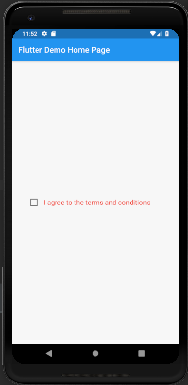
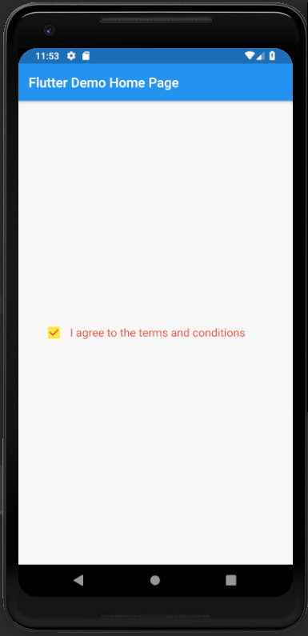

# checkbox

A new Flutter application which implements a checkbox

## How to implement a Checkbox

- Use the following code to implement a Checkbox Widget

```

            Checkbox(
                value: selectedValue,
                onChanged: (bool value) {
                  setState(() {
                    selectedValue = value;
                  });
                },
                activeColor: Colors.yellow,
                checkColor: Colors.red,
              ),

```

- To set the color of the selected box , we use the activeColor attribute

```

    activeColor: Colors.yellow

```

- To set the color of the tick in the selected box, we use the checkColor attribute

```

    checkColor: Colors.red

```


### Screenshots

 