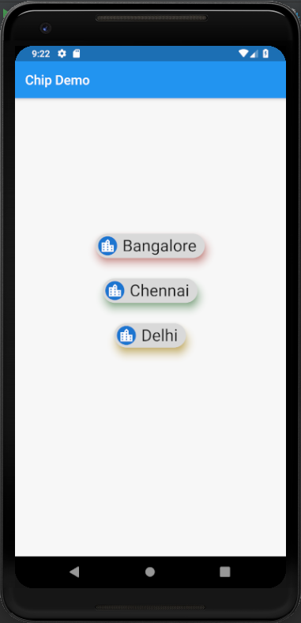

# chip

A new Flutter application which implements a chip

## How to implement a Chip

- Use the following code to implement a Chip in flutter

```

            Chip(
              label: Text(
                "Delhi",
                style: TextStyle(
                    fontSize: 25.0
                ),
              ),
              elevation: 10.0,
              avatar: CircleAvatar(
                child: Icon(Icons.location_city),
              ),
              shadowColor: Colors.amber,
            )

```

### Screenshot

