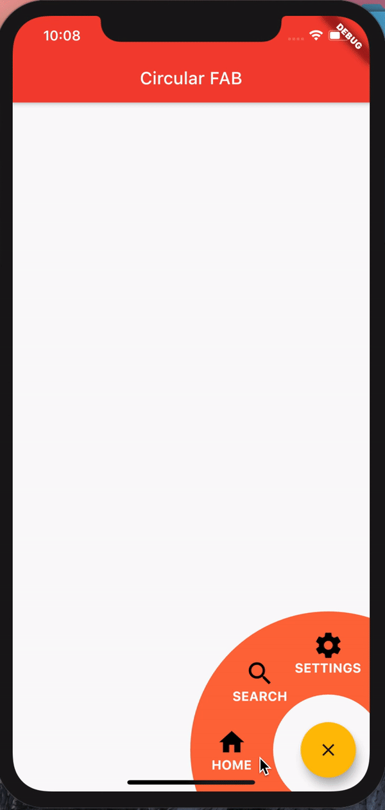

# Circular Floating Action Button

The original package : [pub.dev](https://pub.dev/packages/fab_circular_menu#-readme-tab-)

```
    dependencies:
        fab_circular_menu: ^1.0.0
```

# Working 


**To Add an Item to the FAB :**

```dart
    RawMaterialButton(
        onPressed: () {

        },
        shape: CircleBorder(),
        padding: const EdgeInsets.all(24.0),
        child: Column(
            mainAxisAlignment: MainAxisAlignment.center,
            children: [
            Icon(Icons.search, color: Colors.black,size: 35,),
            Text(
                "SEARCH",
                style: TextStyle(
                fontWeight: FontWeight.bold,
                fontSize: 15,
                color: Colors.white
                ),
            )
            ],
        ),
    ),
```