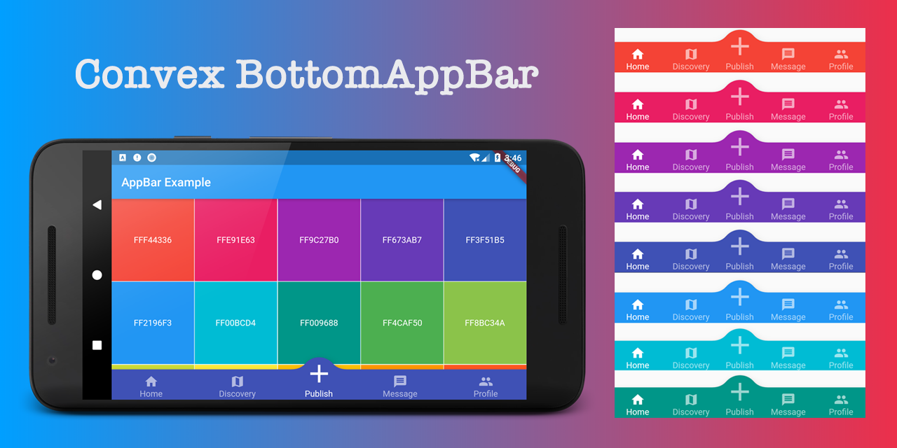
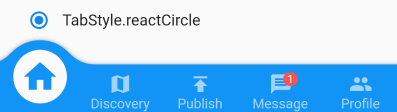

# convex_bottom_bar_example

The official BottomAppBar can only display a notch FAB with app bar, sometimes we need a convex FAB. This ConvexAppBar is inspired by BottomAppBar and NotchShape's implementation.

Online example can be found at https://appbar.codemagic.app.

convex_bottom_bar is now a Flutter Favorite package!

How to use 
Typically ConvexAppBar can work with Scaffold by setup its bottomNavigationBar.

The ConvexAppBar has to two constructors, the ConvexAppBar() will use default style to simplify the tab creation.

Add this to your package's pubspec.yaml file:

dependencies:
  convex_bottom_bar:

  
