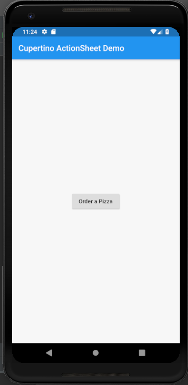
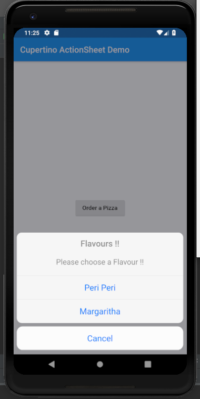

# cupertino_action_sheet

A new Flutter application which implements a CupertinoActionSheet Widget

## How to add a Cupertino ActionSheet in flutter

- USe the following code in the onPressed of any widget (here RaisedButton) to open the 
CupertinoActionSheet

```

                final ack = CupertinoActionSheet(
                  title: Text(
                    "Flavours !!",
                    style: TextStyle(
                      fontSize: 20.0
                    ),
                  ),
                  message: Text(
                    "Please choose a Flavour !!",
                    style: TextStyle(
                      fontSize: 18.0
                    ),
                  ),
                  actions: <Widget>[
                    CupertinoActionSheetAction(
                      child: Text("Peri Peri"),
                      onPressed: () {
    
                      },
                    ),
    
                    CupertinoActionSheetAction(
                      child: Text("Margaritha"),
                      onPressed: () {
    
                      },
                    )
                  ],
    
                  cancelButton: CupertinoActionSheetAction(
                      onPressed: () {
    
                      },
                      child: Text("Cancel")
                  ),
                );
    
                showCupertinoModalPopup(
                    context: context,
                    builder: (BuildContext context) => ack
                );

```

### Screenshots

 