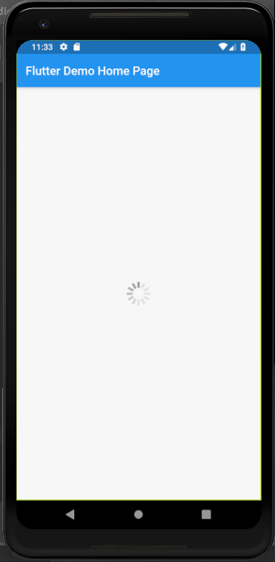

# cupertino_activity_indicator

A new Flutter application which implements a CupertinoActivityIndicator

## How to implement a CupertinoActivityIndicator

- Use the following code to implement a CupertinoActivityIndicator

```

        CupertinoActivityIndicator(
          animating: true,
          radius: 20.0,
        )

```

- The <b>radius:</b> field specifies the radius of the ActivityIndicator

- The <b>animating:</b> field takes either true or false , which specifies whether the ActivityIndicator
should rotate or not


### Screenshot

