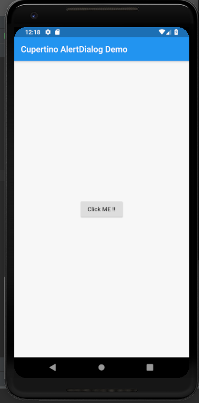
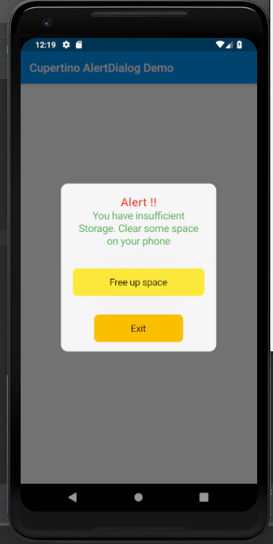

# cupertino_alert_dialog

A new Flutter application which implements CupertinoAlertDialog

## How to implement a CupertinoAlertDialog

- Use the code below to implement a CupertinoAlertDialog

```

            showDialog(
              context: context,
              builder: (BuildContext context) => CupertinoAlertDialog(
                title: Text(
                  "Alert !!",
                  style: TextStyle(
                    fontSize: 20.0,
                    color: Colors.red
                  ),
                ),
                content: Text(
                  "You have insufficient Storage. Clear some space on your phone",
                  style: TextStyle(
                    fontSize: 18.0,
                    color: Colors.green
                  ),
                ),
                actions: <Widget>[
                  CupertinoActionSheetAction(
                      onPressed: () {

                      },
                      child: CupertinoButton(
                          color: Colors.yellow,
                          child: Text(
                            "Free up space",
                            style: TextStyle(
                              color: Colors.black
                            ),
                          ),
                          onPressed: () {

                          }
                          ),
                  ),

                  CupertinoActionSheetAction(
                    onPressed: () {

                    },
                    child: CupertinoButton(

                        color: Colors.amber,
                        child: Text(
                            "Exit",
                            style: TextStyle(
                              color: Colors.black
                            ),
                        ),
                        onPressed: () {
                          Navigator.of(context).pop();
                        }
                    ),
                  ),
                ],
              )
            );

```

- Put this code inside the onPressed of a RaisedButton to call this AlertDialog when the button is 
clicked.

### Screenshots

 