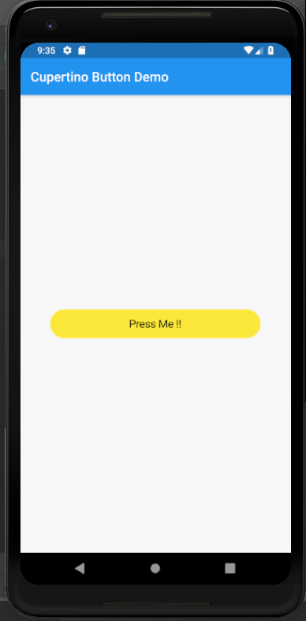

# cupertino_button

A new Flutter application which implements a CupertinoButton.

## How to implement a CupertinoButton

- Use the following code to implement a CupertinoButton

```dart

        CupertinoButton(
          child: Text(
            "Press Me !!",
            style: TextStyle(
              color: Colors.black,
            ),
          ),
          onPressed: () {

          },
          color: Colors.yellow,
          borderRadius: BorderRadius.all(Radius.circular(30.0)),
          padding: EdgeInsets.only(left: 120.0,right: 120.0),
          pressedOpacity: 0.2,
        )

``` 

- To set the border as circular border with a specified radius , we use

```dart

    borderRadius: BorderRadius.all(Radius.circular(30.0)),

```

### Screenshot


