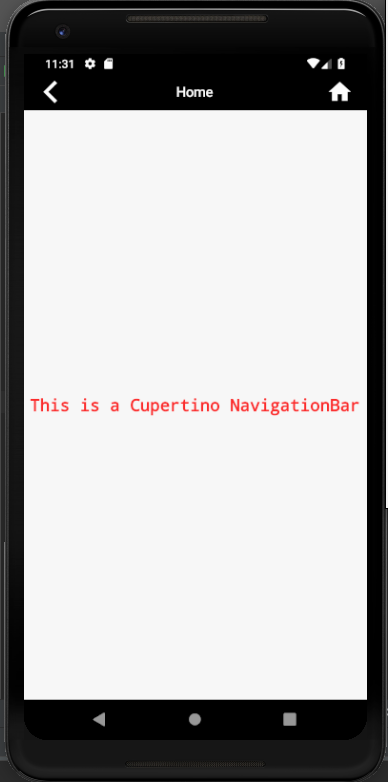

# cupertino_navigation_bar

A new Flutter application which implements CupertinoNavigationBar

## How to implement a CupertinoNavigationBar

- Use the code below inside a CupertinoPageScaffold to implement a CupertinoNavigationBar

```

      navigationBar: CupertinoNavigationBar(
        leading: Icon(Icons.arrow_back_ios,color: Colors.white,),
        middle: Text(
          "Home",
          style: TextStyle(
            color: Colors.white
          ),
        ),
        trailing: Icon(Icons.home,color: Colors.white,),
        backgroundColor: Colors.black,
      ),

```

### Screenshot

