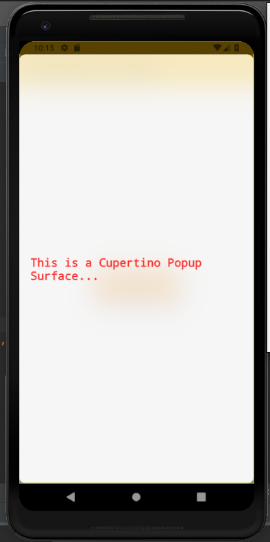

# cupertino_popup_surface

A new Flutter application which implements a CupertinoPopupSurface

## How to implement a CupertinoPopupSurface

- Use the following code to implement a CupertinoPopupSurface

```dart

            showDialog(
              context: context,
              builder: (BuildContext context) => CupertinoPopupSurface(
                child: Center(
                  child: Padding(
                    padding: EdgeInsets.only(left: 20.0),
                    child: Text(
                      "This is a Cupertino Popup Surface...",
                      style: TextStyle(
                          decoration: TextDecoration.none,
                          fontSize: 20.0
                      ),
                    ),
                  )
                )
              )
            );

```

### Screenshots

 
