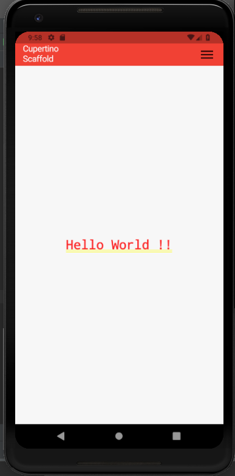

# cupertino_scaffold

A new Flutter application which implements a CupertinoPageScaffold.

## How to implement a CupertinoPageScaffold

- Use the below code to implement a CupertinoPageScaffold

```

    CupertinoPageScaffold(
      navigationBar: CupertinoNavigationBar(
        leading: Text(
          "Cupertino Scaffold",
          style: TextStyle(
            color: Colors.white
          ),
        ),
        backgroundColor: Colors.red,
        trailing: Icon(Icons.menu),
      ),
      child: SafeArea(
        child: Center(
          child: Text(
            "Hello World !!",
            style: TextStyle(
              fontSize: 25.0
            ),
          ),
        ),
      ),
    )

```

- SafeArea() is used to provide a body to the CupertinoScaffold

```

      SafeArea(
        child: Center(
          child: Text(
            "Hello World !!",
            style: TextStyle(
              fontSize: 25.0
            ),
          ),
        ),
      ),

```

### Screenshot


