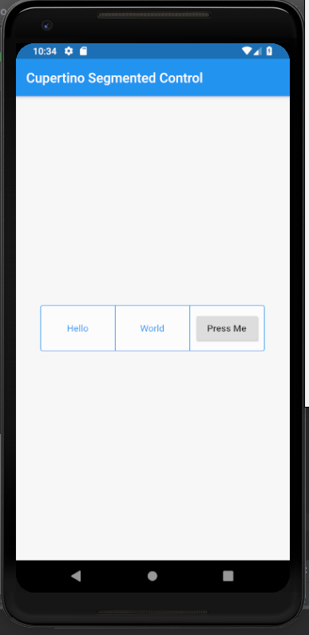

# cupertino_segmented_control

A new Flutter application which implements CupertinoSegmentedControl

## How to implement a CupertinoSegmentedControl

- Use the code below to set up a CupertinoSegmentedControl Widget

```

        CupertinoSegmentedControl(
            children: <int,Widget> {
              0: Text(
                "Hello"
              ),

              1: Text(
                "World"
              ),

              2: Padding(
                padding: EdgeInsets.all(10.0),
                child: RaisedButton(
                  child: Text(
                      "Press Me"
                  ),
                  onPressed: () {

                  },
                ),
              ),

            },
            onValueChanged: (int val) {
              setState(() {
                this.val = val;
              });
            },

        )

```

### Screenshot


