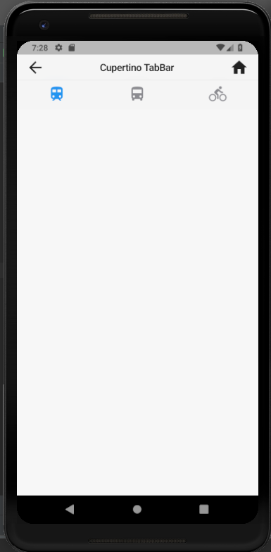
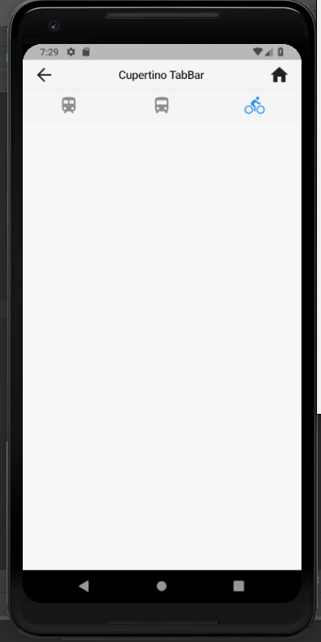

# cupertino_tab_bar

A new Flutter application which implements a CupertinoTabBar

## How to implement a CupertinoTabBar

- Use the code below to implement a CupertinoTabBar

```

    CupertinoPageScaffold(
      navigationBar: CupertinoNavigationBar(
        leading: Icon(Icons.arrow_back),
        middle: Text(
          "Cupertino TabBar"
        ),
        trailing: Icon(Icons.home),
      ),
      child: SafeArea(
        child: CupertinoTabBar(
          items: <BottomNavigationBarItem>[
            BottomNavigationBarItem(
              icon: Icon(Icons.train)
            ),

            BottomNavigationBarItem(
              icon: Icon(Icons.directions_bus)
            ),

            BottomNavigationBarItem(
              icon: Icon(Icons.directions_bike)
            )
          ],
          currentIndex: currentIndex,
          onTap: (int index) {
            setState(() {
              currentIndex = index;
            });
          },
        ),
      ),
    )

```

### Screenshots

 