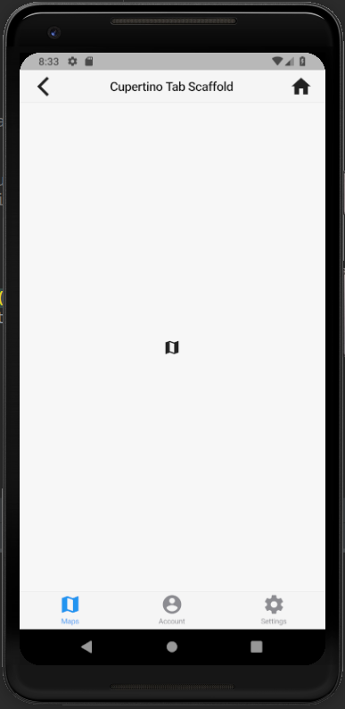
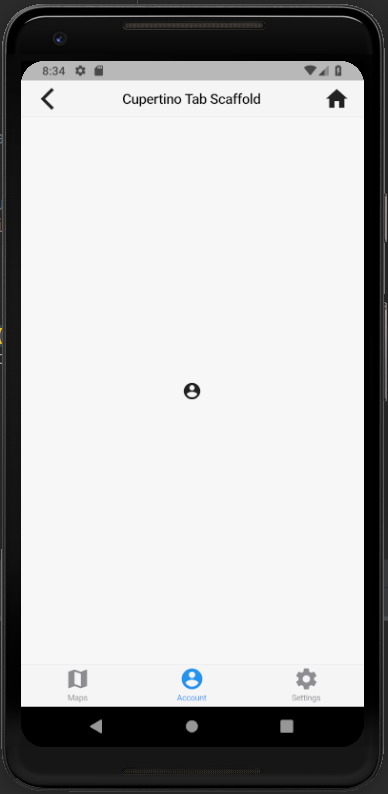

# cupertino_tab_scaffold

A new Flutter application which implements CupertinoTabScaffold

## How to implement a CupertinoTabScaffold

- Use the following code to implement a CupertinoTabScaffold

```

    CupertinoTabScaffold(
      tabBar: CupertinoTabBar(
        items: <BottomNavigationBarItem>[
          BottomNavigationBarItem(icon: Icon(Icons.map),title: Text("Maps")),
          BottomNavigationBarItem(icon: Icon(Icons.account_circle),title: Text("Account")),
          BottomNavigationBarItem(icon: Icon(Icons.settings),title: Text("Settings")),
        ],
        onTap: (int index) {
          setState(() {
            selectedTabIndex = index;

            if(index==0)
              icon = Icons.map;
            else if(index==1)
              icon = Icons.account_circle;
            else
              icon = Icons.settings;
          });
        },
        currentIndex: selectedTabIndex,
      ),

      tabBuilder: (BuildContext context,int index) {
        return CupertinoTabView(
          builder: (BuildContext context) {
            return CupertinoPageScaffold(
              navigationBar: CupertinoNavigationBar(
                leading: Icon(Icons.arrow_back_ios),
                middle: Text(
                  "Cupertino Tab Scaffold"
                ),
                trailing: Icon(Icons.home),
              ),
              child: SafeArea(
                child: Center(
                  child: Icon(icon)
                )
              ),
            );
          },
        );
      },
    )

```

### Screeshots

 

