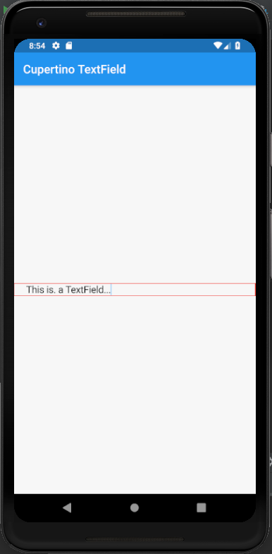

# cupertino_textfield

A new Flutter application which implements a CupertinoTextField

## How to implement a CupertinoTextField

- Use the following code to implement a CupertinoTextField

```dart

        CupertinoTextField(
          padding: EdgeInsets.only(left: 20.0),
          decoration: BoxDecoration(
            border: Border.all(
              color: Colors.red
            )
          ),
        )

```

### Screenshot


