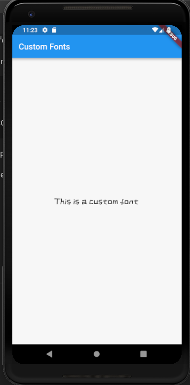

# custom_fonts

A new Flutter project to explain how custom fonts can be used in flutter apps.

## Steps to use Custom fonts in Flutter
<hr>

* Download the font from Google fonts and download the .ttf file.

* Create a folder in the main project directory named fonts.

* Paste the .ttf font file in this folder.

* Then go to pubspec.yml file and add the following line:

```dart 
fonts:
    - family: ZCOOLKuaiLe
      fonts:
        - asset: fonts/ZCOOLKuaiLe-Regular.ttf
```
* The details of the font file depends on the one you downloaded.

* Then save the file and now the custom font can be used in our app :)



