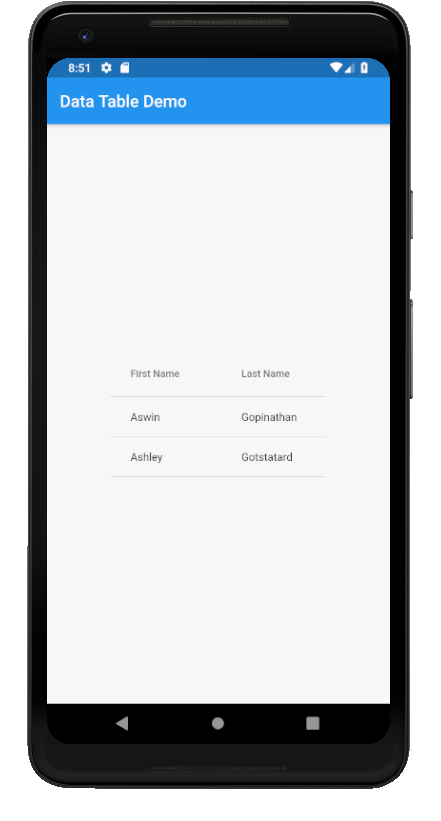

# data_table

A new Flutter application which implements a DataTable

## How to implement a DataTable

- Use the following code to implement a DataTable

```dart

        DataTable(
            columns: <DataColumn>[
              DataColumn(
                label: Text("First Name"),
                onSort: (i,b) {
                  setState(() {
                    names.sort((a,b)=>a.fname.compareTo(b.fname));
                  });
                }
              ),

              DataColumn(
                  label: Text("Last Name"),
                  onSort: (i,b) {
                    setState(() {
                      names.sort((a,b)=>a.lname.compareTo(b.lname));
                    });
                  }
              )
            ],
            rows: names.map((name)=> DataRow(
              cells: [
                DataCell(
                  Text(name.fname)
                ),

                DataCell(
                  Text(name.lname)
                )
              ]
            )).toList()
        )

```

- Use the following code to setup the column headers

```dart

            columns: <DataColumn>[
              DataColumn(
                label: Text("First Name"),
                onSort: (i,b) {
                  setState(() {
                    names.sort((a,b)=>a.fname.compareTo(b.fname));
                  });
                }
              ),

              DataColumn(
                  label: Text("Last Name"),
                  onSort: (i,b) {
                    setState(() {
                      names.sort((a,b)=>a.lname.compareTo(b.lname));
                    });
                  }
              )
            ],

```

- To setup the rows with values use the following code

```dart

              rows: names.map((name)=> DataRow(
                cells: [
                  DataCell(
                    Text(name.fname)
                  ),
  
                  DataCell(
                    Text(name.lname)
                  )
                ]
              )).toList()  

```

### Screenshot


