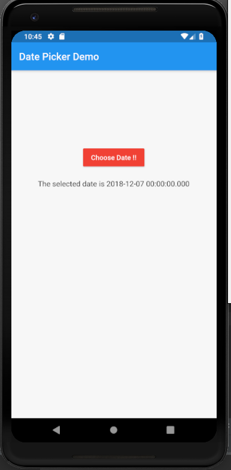
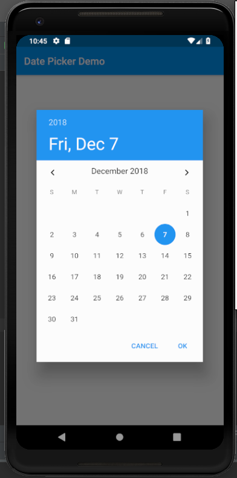

# date_picker

A new Flutter application that implements DatePicker Widget

## Steps to implement DatePicker Widget

- Declare a variable <b>_date</b> that stores the current Date and Time

```dart

    DateTime _date = DateTime.now();

```

- Declare a method which shows up the calender to select the required Date

```dart

    Future<Null> selectDate (BuildContext context) async {
    
        final DateTime picked = await showDatePicker(
            context: context,
            initialDate: _date,
            firstDate: DateTime(1970),
            lastDate: DateTime(2021)
        );
    
        if(picked!=null && picked!=_date) {
          setState(() {
            _date = picked;
          });
        }
    
    }

```

- Call the above method in the onPressed field of the RaisedButton Widget

```dart

              RaisedButton(
                  onPressed: () {
                    selectDate(context);
                  },
                child: Text(
                  "Choose Date !!"
                ),
                color: Colors.red,
                textColor: Colors.white,
              ),

```


### Screenshot

 
