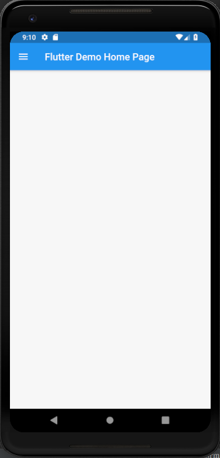
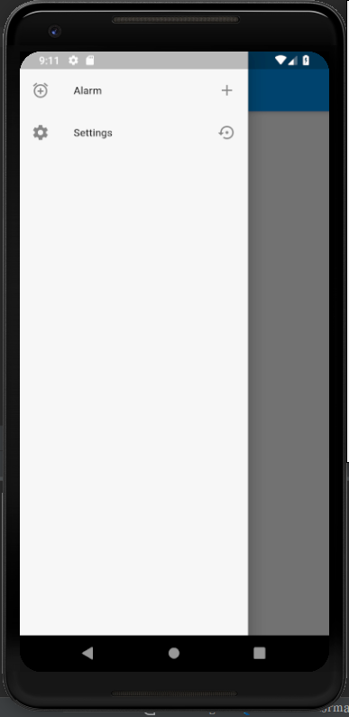

# drawer

A new Flutter application which shows how Drawers work in flutter.

## How to setup a drawer in Flutter

 - Use the following code inside Scaffold:
 
 ```
 
 drawer: Drawer(
         child: ListView(
           children: <Widget>[
             ListTile(
               leading: Icon(Icons.alarm_add),
               title: Text(
                 "Alarm"
               ),
               trailing: Icon(Icons.add),
               onTap: () {
                 Navigator.pop(context);
               },
             ),
             ListTile(
               leading: Icon(Icons.settings),
               title: Text(
                   "Settings"
               ),
               trailing: Icon(Icons.settings_backup_restore),
               onTap: () {
                 Navigator.pop(context);
               },
             )
           ],
         ),
       )
 
```

### Screenshot

 
