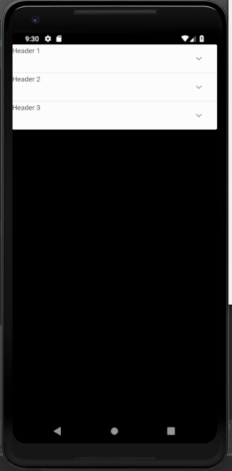
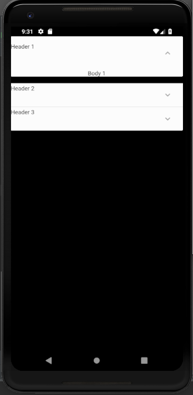
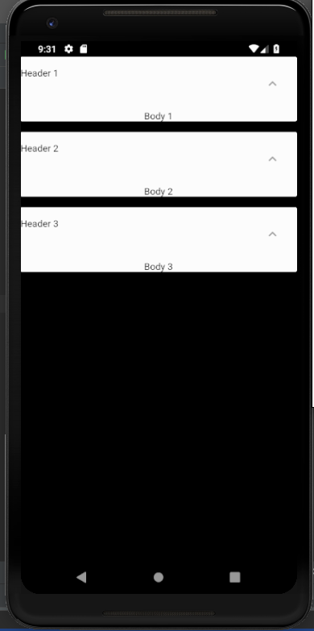

# expanded_panel_list

A new Flutter application which implements ExpandedPanelList and ExpandedPanel.

## How to implement ExpansionPanel and ExpansionPanelList

- First define a class MyItem to define the header,body and isExpanded variables

```

    class MyItem {
      bool isExpanded;
      final String header;
      final String body;
    
      MyItem({this.isExpanded : false,this.header,this.body});
    
    }

```

- Then in the State class define a List of MyItem objects

```

    List<MyItem> _items = <MyItem>[
        MyItem(header: "Header 1",body: "Body 1"),
        MyItem(header: "Header 2",body: "Body 2"),
        MyItem(header: "Header 3",body: "Body 3"),
      ];
 
```

- The header attribute represents the header of the ExpansionPanel and body attribute represents
the body of the ExpansionPanel

- Then to make the ExpansionPanel Lists use the following code

```

    ListView(
      children: <Widget>[
        ExpansionPanelList(
          expansionCallback: (int index,bool isExpanded) {
            setState(() {
              _items[index].isExpanded = !_items[index].isExpanded;
            });
          },
          children: _items.map(
              (MyItem myItem) {
                return ExpansionPanel(
                  headerBuilder: (BuildContext context,bool isExpanded) {
                    return Text(
                      myItem.header
                    );
                  },
                  isExpanded: myItem.isExpanded,
                  body: Container(
                    child: Text(
                      myItem.body
                    ),
                  ),
                  canTapOnHeader: true
                );
              }
          ).toList(),
        )
      ],
    )

```


### Screenshots

  