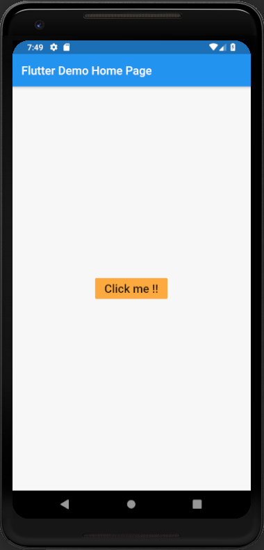

# flat_button

A new Flutter application which implements a Flat Button.

## How to implement Flat Button

- Use the following code to implement a Flat button Widget.

```dart

    FlatButton(
                onPressed: () {
                  print("Button Clicked");
                },
                child: Text(
                  "Click me !!",
                  style: TextStyle(
                    fontSize: 20.0
                  ),
                ),
              color: Colors.orangeAccent,
              highlightColor: Colors.red,
            ),

```

 - To set the color of the button use the color attribute
 
 ```dart
 
 color: Colors.orange
 
 ```
 
 - To set the color on Click of the button , use the highlightColor attribute
 
 ```dart
 
 highlightColor: Colors.red
 
 ```
 
 ### Screenshot
 
 
