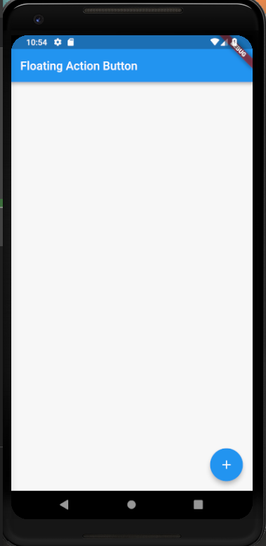

# floating_action_button

A new Flutter project which shows how to use a Floating Action Button in a Flutter app.

## Steps to use a FAB

* In the Scaffold give:

```dart

floatingActionButton: FloatingActionButton(
        child: Icon(Icons.add),
        onPressed: () {

        },
        tooltip: "YOU Pressed a FAB",
      ),

```

- We can also implement FAB as a child to a parent Widget as follows:

```dart

child: FloatingActionButton(
    onPressed: () {
       
    },
    child: Icon(Icons.add),
)

```

### Screenshot


