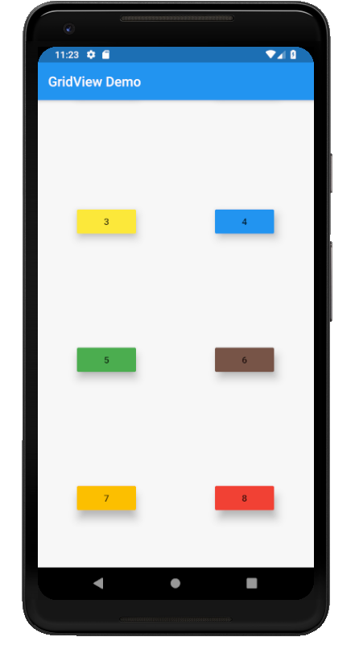

# grid_view

A new Flutter application which implements a GridView

## How to implement a GridView

- Use the following code to implement a GridView with 2 columns

```

      GridView.count(
        crossAxisCount: 2,
        children: <Widget>[
          Center(
            child: RaisedButton(
              child: Text("1"),
              onPressed: () {

              },
              color: Colors.amber,
              elevation: 10.0,
            )
          ),
          Center(
              child: RaisedButton(
                child: Text("2"),
                onPressed: () {

                },
                color: Colors.red,
                elevation: 10.0,
              )
          ),
          Center(
              child: RaisedButton(
                child: Text("3"),
                onPressed: () {

                },
                color: Colors.yellow,
                elevation: 10.0,
              )
          ),
          Center(
              child: RaisedButton(
                child: Text("4"),
                onPressed: () {

                },
                color: Colors.blue,
                elevation: 10.0,
              )
          ),
          Center(
              child: RaisedButton(
                child: Text("5"),
                onPressed: () {

                },
                color: Colors.green,
                elevation: 10.0,
              )
          ),
          Center(
              child: RaisedButton(
                child: Text("6"),
                onPressed: () {

                },
                color: Colors.brown,
                elevation: 10.0,
              )
          ),

          Center(
              child: RaisedButton(
                child: Text("7"),
                onPressed: () {

                },
                color: Colors.amber,
                elevation: 10.0,
              )
          ),

          Center(
              child: RaisedButton(
                child: Text("8"),
                onPressed: () {

                },
                color: Colors.red,
                elevation: 10.0,
              )
          ),

        ],
      )

```

- The attribute crossAxisCount specifies the no. of columns in the grid

### Screenshot

