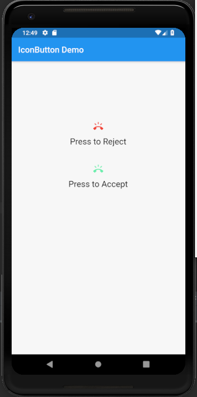

# icon_button

A new Flutter application which explains how to implement IconButton in Flutter

## How to implement a IconButton

- Use the following code to implement a IconButton Widget

```

              IconButton(
                  icon: Icon(Icons.ring_volume),
                  onPressed: () {

                  },
                color: Colors.red,
              ),

```

### Screenshot

