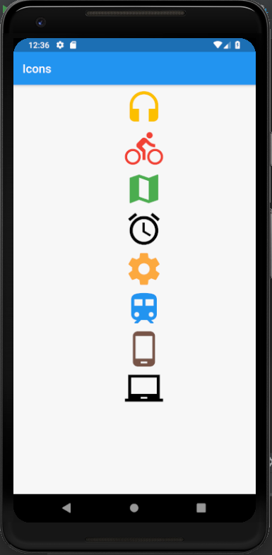

# icons

A new Flutter application which explains the implementation of Icons.

## How to implement Icons

- Use the code below to implement an Icon 

```dart

    Icon(Icons.map, color:Colors.red)

```

- The icons can be declared as a variable using the following code

```dart

    Icon icon = Icon(Icons.train)

```

### Screenshot


