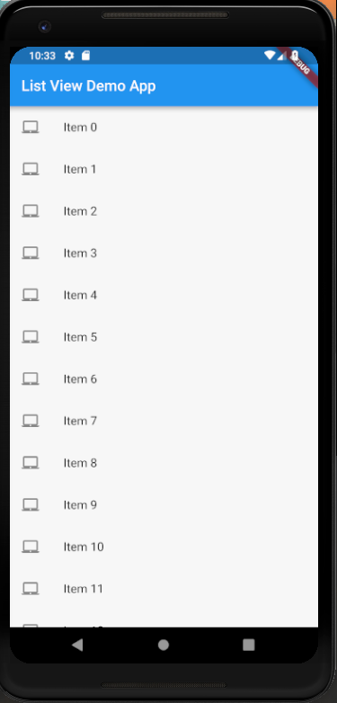

# list_views

A new Flutter project which explains how to use List Views in flutter.

## Steps to use List Views

* First of all we create a List of elements to inflate the List View :

```dart

List<String> getListElements() {
    var items = List<String>.generate(1000,(counter)=>"Item $counter");
    return items;
}

```

* Then we create a method which returns a ListView Widget:

```dart

Widget getList(BuildContext context, List<String> items) {

    var listItems = getListElements();

    var listView = ListView.builder(itemBuilder: (context, index) {
      return ListTile(
        leading: Icon(Icons.laptop_mac),
        title: Text(listItems[index]),
        onTap: () {
          debugPrint('${listItems[index]} was tapped');
        },
      );
    });

    return listView;
  }

```

* Then we call the getList() from the body attribute of Scaffold:

```dart

body: getList(context, getListElements())

```

<hr>


