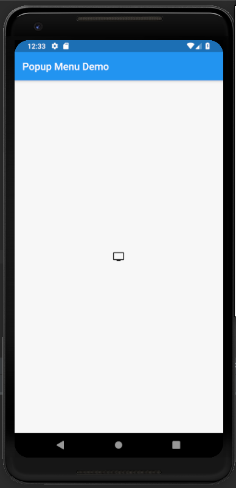
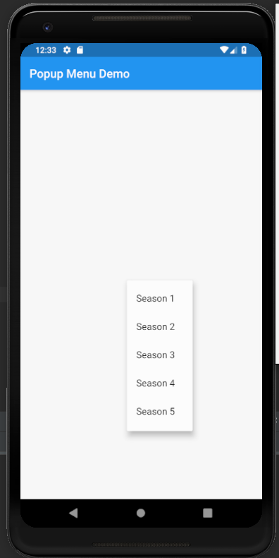

# popup_menu_button

A new Flutter application which explains how to implement a PopupMenuButton in flutter.

## How to implement PopupMenuButton in flutter

- Use the following code to implement PopupMenuButton

```dart

        PopupMenuButton<items>(
          onSelected: (items result) {
            setState(() {

            });
          },

          itemBuilder: (BuildContext context) => <PopupMenuEntry<items>> [
            const PopupMenuItem<items>(
              value: items.season1,
              child: Text(
                'Season 1'
              ),
            ),

            const PopupMenuItem<items>(
              value: items.season2,
              child: Text(
                  'Season 2'
              ),
            ),

            const PopupMenuItem<items>(
              value: items.season3,
              child: Text(
                  'Season 3'
              ),
            ),

            const PopupMenuItem<items>(
              value: items.season4,
              child: Text(
                  'Season 4'
              ),
            ),

            const PopupMenuItem<items>(
              value: items.season5,
              child: Text(
                  'Season 5'
              ),
            ),
          ],
          icon: Icon(Icons.tv),
        )

```

- To add individual items we use the following code

```dart

            const PopupMenuItem<items>(
              value: items.season5,
              child: Text(
                  'Season 5'
              ),
            ),

```

### Screenshots

 
