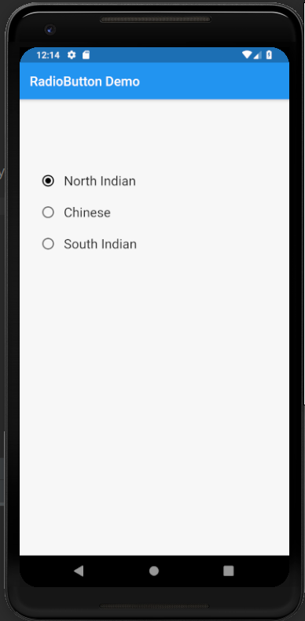
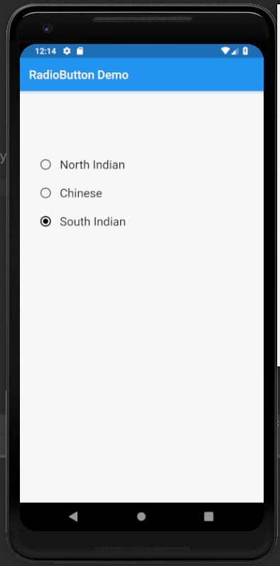

# radio_button

A new Flutter application which implements Radio Widget

## How to implement a Radio Groups

- Use the following code to add a Radio button

```dart

    Radio(
        value:1,
        groupValue:1,
        onChanged:(T) {
            
        },
    )

```

- The <b>value</b> represent the value of the RadioButton

- The <b>groupValue</b> is used to group a bunch of radio buttons such that only one radio button
amoungst the group can be selected at a time.


### Screenshots

 
