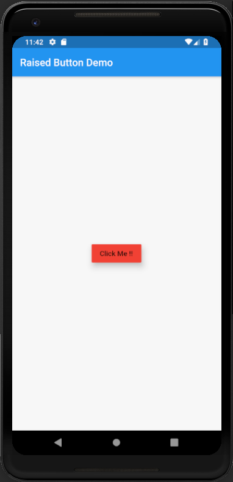

# raised_button

A new Flutter application which implements Raised Button.

## How to implement a RaisedButton Widget in Flutter

- Use the following code to implement a RaisedButton

```dart

    RaisedButton(
              onPressed: () {
    
                },
              child: Text(
                "Click Me !!"
              ),
              color: Colors.red,
              elevation: 10.0,
            )

```

- The elevation of the button can be set by changing the value in the elevation attribute

```dart

    elevation: 10.0

```


### Screenshot


