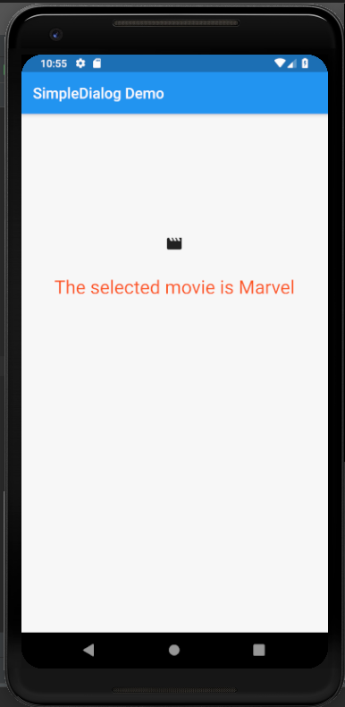
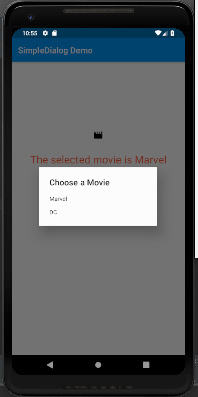
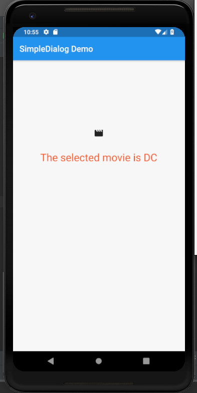

# simple_dialog

A new Flutter application which implements a SimpleDialog Widget

## How to implement SimpleDialog

- Define a method which calls the SimpleDialog Widget with two options

```dart

  Future<void> openDialog() async {
    switch(await showDialog(
      context: context,
      builder: (BuildContext context) {
        return SimpleDialog(
          title: const Text(
            "Choose a Movie"
          ),
          children: <Widget>[
            SimpleDialogOption(
              onPressed: () {
                Navigator.pop(context,Movies.Marvel);
              },
              child: Text("Marvel"),
            ),

            SimpleDialogOption(
              onPressed: () {
                Navigator.pop(context,Movies.DC);
              },
              child: Text("DC"),
            )
          ],
        );
      }
    )) {
      case Movies.Marvel: setState(() {
        selectedMovie = "Marvel";
      });
      break;

      case Movies.DC: setState(() {
        selectedMovie = "DC";
      });
      break;
    }
  }

```

- Call this method from any Widget

```dart

              IconButton(
                icon: Icon(Icons.movie),
                onPressed: () {
                  openDialog();
                },
              ),

```


### Screenshots

  
