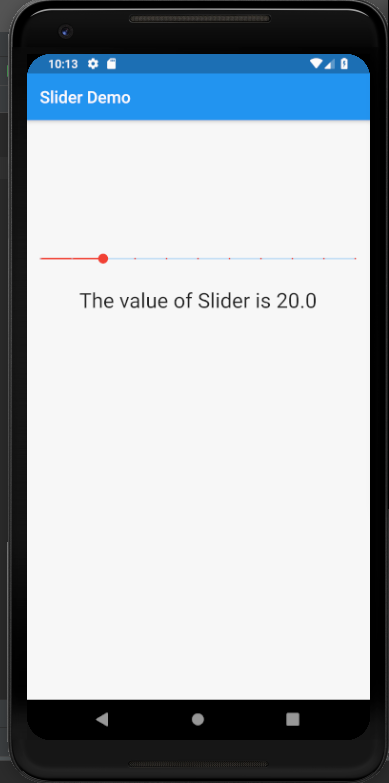

# slider

A new Flutter application that implements Slider Widget

## How to implement Slider Widget in Flutter

- Use the following code to implement Slider

```dart

               Slider(
                  value: sliderValue,
                  onChanged: (double value) {
                    setState(() {
                      sliderValue = value;
                    });
                  },
                  min: 0,
                  max: 100,
                  divisions: 10,
                  activeColor: Colors.red,
              ),

```

- The minimum and maximum value of the slider is set by the min and max attribute

```dart

    min:0
    max:100

```

- The no. of divisions is set by the divisions attribute

```dart

    divisions:100

```


### Screenshot


