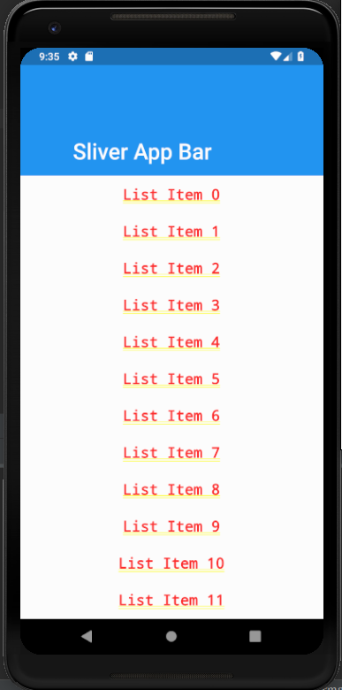
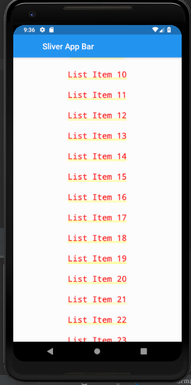

# sliver_appbar

A new Flutter application which exhibits the use of Sliver App bars in Flutter

## How to use Sliver App Bar 

- In the home part of MaterialApp give the following code to implement Sliver App bar

```

CustomScrollView(
      slivers: <Widget>[
        SliverAppBar(
          pinned: true,
          expandedHeight: 150.0,
          flexibleSpace: FlexibleSpaceBar(
            title: Text(
              "Sliver App Bar"
            ),
          ),
        ),
        SliverFixedExtentList(
            delegate: SliverChildBuilderDelegate(
                (BuildContext context,int index) {
                  return Container(
                      alignment: Alignment.center,
                      color: Colors.white,
                      child: Text(
                        "List Item $index",
                        style: TextStyle(
                          fontSize: 20.0
                        ),
                      )
                  );
                }
            ),
            itemExtent: 50.0
        )
      ],
    )

```

- To adjust the size of the app bar at the starting chnage the value in the following code:

```

 expandedHeight: 150.0

```

### Screenshots

 