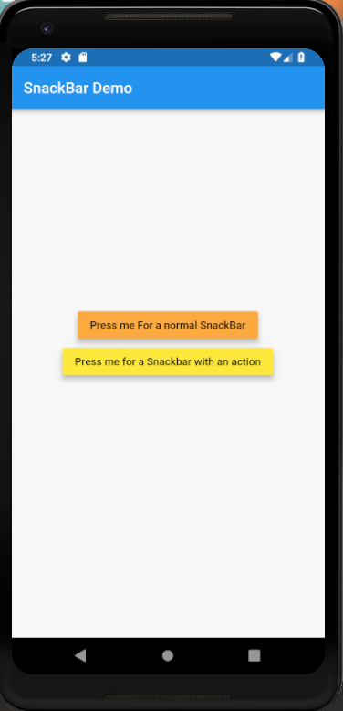
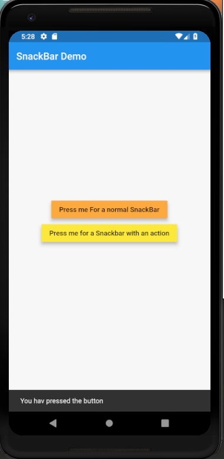
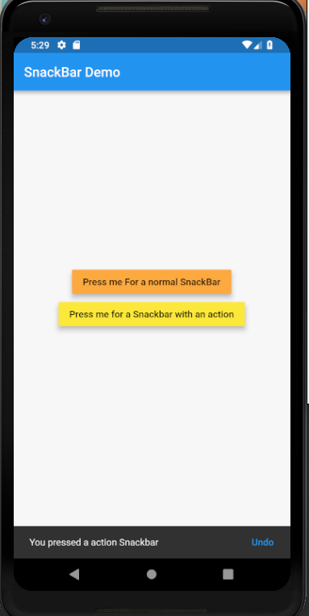

# snack_bar

A new Flutter project which explains how to use SnackBars in flutter.

## Steps to implement SnackBars

* There are two types of Snack bars:
1. Normal SnackBar
2. SnackBars with an action

* Normal Snackbars can be implemented as:

```dart

void normalSnackBar(BuildContext context) {
    var snackBar = SnackBar(
      content: Text(
        "You hav pressed the button"
      ),
    );

    Scaffold.of(context).showSnackBar(snackBar);
  }

  ```

  * SnackBars with an action can be implemented as:

  ```dart

  void actionSnackBar(BuildContext context) {
    var snackBar = SnackBar(
      content: Text(
        "You pressed a action Snackbar"
      ),
      action: SnackBarAction(
        label: "Undo",
        onPressed: () {

        },
      ),
    );

    Scaffold.of(context).showSnackBar(snackBar);
  }

```

<hr>

 

