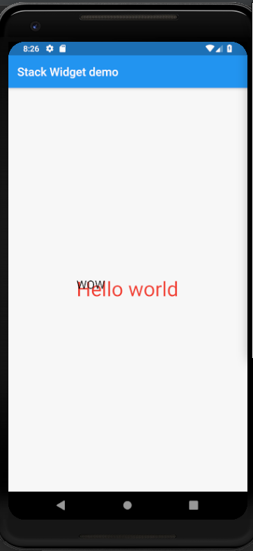

# stack

A new Flutter application which explains the use of Stack Widget.

## How to use Stack Widget

 - Use the following code to include a Stack widget in the application
 
 ```dart
 
            Stack(
                children: <Widget>[
                  Text(
                    "Hello world",
                    style: TextStyle(
                      color: Colors.red,
                      fontSize: 35.0
                    ),
                  ),
    
                  Text(
                    "WOW",
                    style: TextStyle(
                      color: Colors.black,
                      fontSize: 20.0
                    ),
                  )
    
                ],
              )         
                
 ```
 
  - We can use the alignment parameter to arrange all the overlapping widgets relative to the biggest
  widget.
  
  ```dart
  
    alignment: AlignmentDirectional.bottomStart
  
  ```
  
  
  ### Screenshots
  
  
