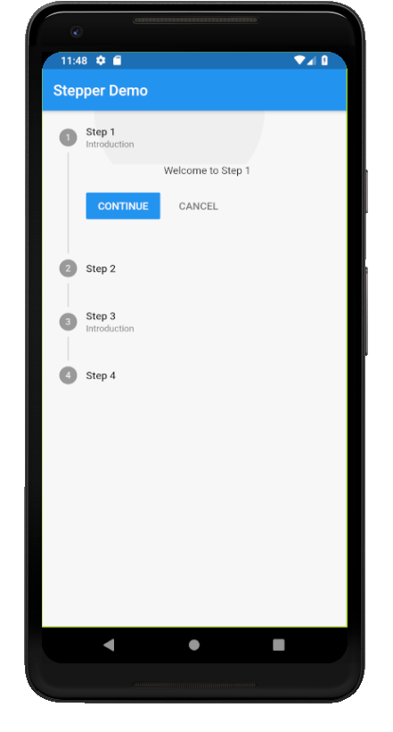
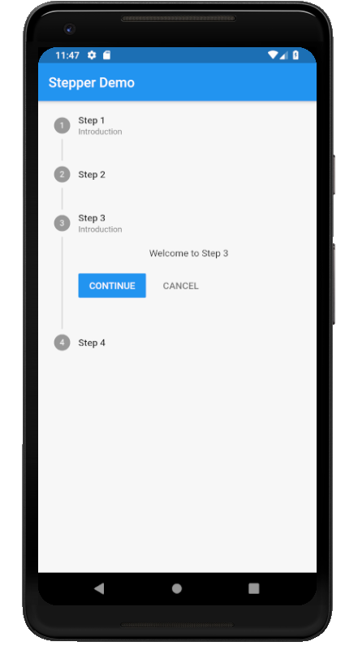

# stepper

A new Flutter application which implements a Stepper

## How to implement a Stepper

- First of all declare the items that have to be converted into a Step in a ListView

```dart

    List<Step> steps = [
        Step(
          title: Text("Step 1"),
          content: Text("Welcome to Step 1"),
          subtitle: Text("Introduction")
        ),
    
        Step(
            title: Text("Step 2"),
            content: Text("Welcome to Step 2"),
        ),
    ];


```

 - Then pass this list to the steps attribute of Stepper Class
 
 ```dart

      Stepper(
        steps: steps,
        currentStep: _currentStep,
        onStepContinue: () {
          setState(() {
            if(_currentStep < steps.length-1)
              _currentStep++;
          });
        },
        onStepCancel: () {
          setState(() {
            if(_currentStep >0)
              _currentStep--;
          });
        },
        onStepTapped: (int value) {
          setState(() {
            _currentStep = value;
          });
        },
      )

```

- The onStepContinue: is called when we click on the Continue button associated with each Step

```dart

        onStepContinue: () {
          setState(() {
            if(_currentStep < steps.length-1)
              _currentStep++;
          });
        }

```

- The onStepCancel: is called when we click on the Cancel button associated with each Step

```dart

        onStepCancel: () {
          setState(() {
            if(_currentStep >0)
              _currentStep--;
          });
        }
```

- The onStepTapped: is called when we click on any random Step

```dart

        onStepTapped: (int value) {
          setState(() {
            _currentStep = value;
          });
        }

```

### Screenshots

 

