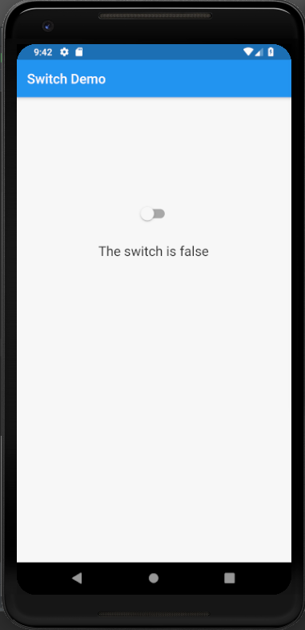
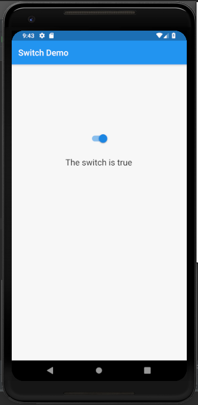

# switch_widget

A new Flutter application which implements a Switch Widget

## How to implement a Switch Widget

- Use the following code to implement a Switch Widget

```

                Switch(
                  value: state,
                  onChanged: (bool state) {
                    setState(() {
                      this.state = state;
                    });
                  },
                ),

```

### Screenshot

 