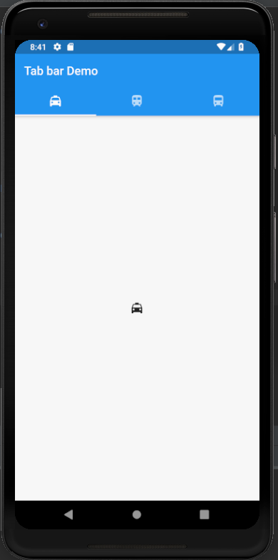
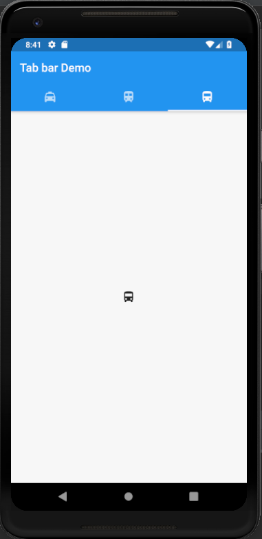

# tab_bar

A new Flutter application which shows how to implement Tab bars in flutter apps

## How to use Tab Bars in Flutter

- Use the code below to implement a tab bar with 3 options. In the MaterialApp Widget give the 
following code:

```dart

home: DefaultTabController(
          length: 3,
          child: Scaffold(
            appBar: AppBar(
              title: Text(
                "Tab bar Demo"
              ),
              bottom: TabBar(
                  tabs: [
                    Tab(
                      icon: Icon(Icons.local_taxi),
                    ),
                    Tab(
                      icon: Icon(Icons.train),
                    ),
                    Tab(
                      icon: Icon(Icons.directions_bus),
                    )
                  ],
              ),
            ),

              body: TabBarView(
                  children: [
                    Icon(Icons.local_taxi),
                    Icon(Icons.train),
                    Icon(Icons.directions_bus),
                  ]
              )
          )
      )

```


### Screenshots

 
