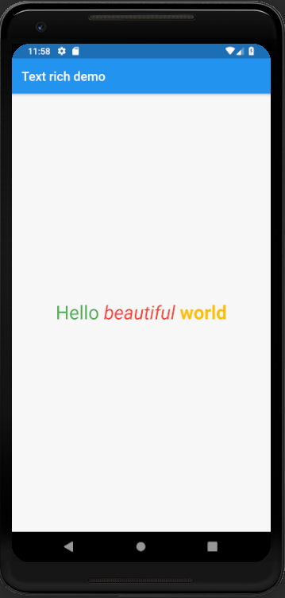

# text_rich

A flutter project to explain the working of rich constructor of Text.

## Steps to use the rich constructor

 - Use the following code to use the constructor

 ```dart
    const Text.rich(
                  TextSpan(
                    text: 'Hello', // default text style
                    children: <TextSpan>[
                      TextSpan(text: ' beautiful ', style: TextStyle(fontStyle: FontStyle.italic)),
                      TextSpan(text: 'world', style: TextStyle(fontWeight: FontWeight.bold)),
                    ],
                  ),
                ),

 ```

<hr>

 
