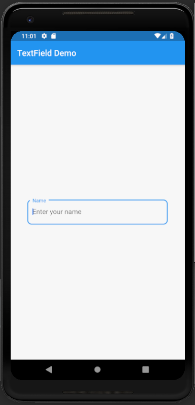
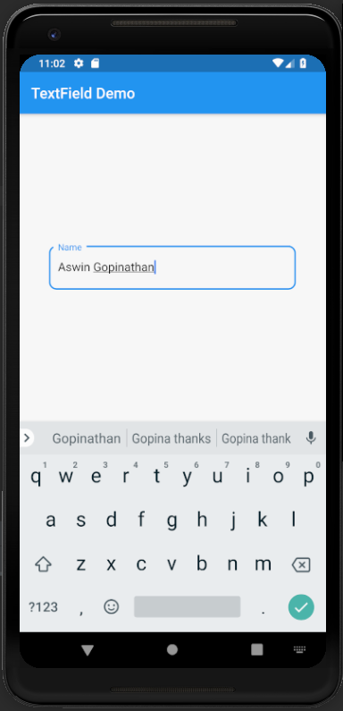

# textfield

A new Flutter application which explains how to use a TextField in flutter

## How to implement a TextField Widget

- Use the code below to add a TextField widget

```dart

   TextField(
               decoration: InputDecoration(
                   labelText: "Name",
                   hintText: "Enter your name",
                   border: OutlineInputBorder(
                     borderRadius: BorderRadius.circular(10.0)
                   )
               ),
             ),

```

- To set the curved border of the TextField, we use

```dart

   border: OutlineInputBorder(
                        borderRadius: BorderRadius.circular(10.0)
                      ) 

```


### Screenshots

 
