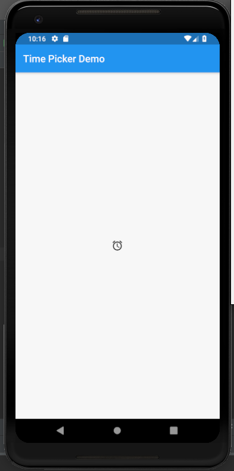
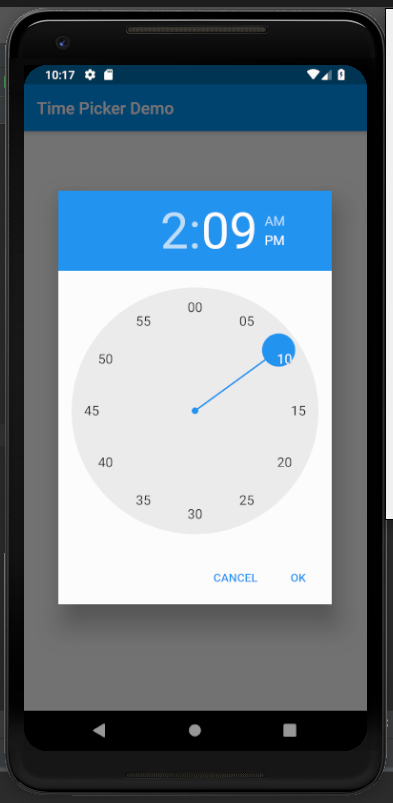

# time_picker

A new Flutter application which implements a time picker Widget

## How to implement Time Picker Widget

- Declare the required variables to store the current time and the selected time

```dart

    TimeOfDay _time = TimeOfDay.now();
    TimeOfDay picked;

```

- Declare method to call the TimePicker Widget

```dart

  Future<Null> selectTime(BuildContext context) async {
    picked = await showTimePicker(
        context: context,
        initialTime: _time,
    );

    if(picked != null && picked != _time) {
      setState(() {
        _time = picked;
      });
    }
  }

```

- Call the above method in any Widget

```dart

        IconButton(
          icon: Icon(Icons.alarm),
          onPressed: () {
            selectTime(context);
          },
        )

```


### Screenshot

  
