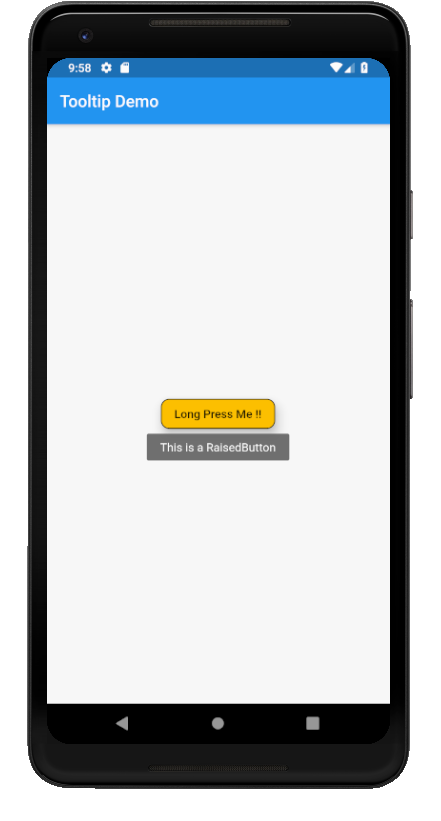

# tooltip

A new Flutter application which implements a Tooltip

## How to implement a Tooltip for a Widget

- Use the following code to wrap a Widget inside a Tooltip

```dart

        Tooltip(
          message: "This is a RaisedButton",
          child: RaisedButton(
            onPressed: () {

            },
            child: Text(
              "Long Press Me !!"
            ),
            shape: OutlineInputBorder(
              borderRadius: BorderRadius.circular(10.0)
            ),
            elevation: 10.0,
            color: Colors.amber,
          ),
        )

```

### Screenshot


